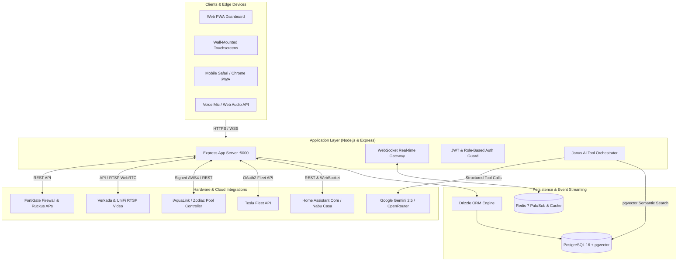
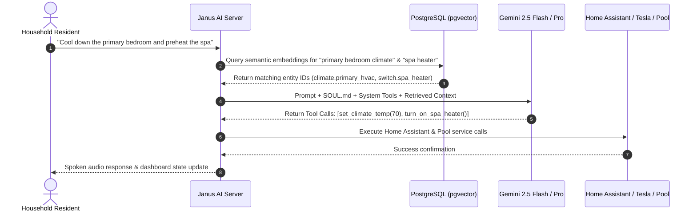

# 🏛️ Architecture & System Design — Household OS (Janus)

Household OS is an enterprise-grade, privacy-conscious residential operating system designed to orchestrate smart home automation, energy telemetry, physical security, community coordination, and voice AI assistance into a unified estate dashboard.

---

## 📐 System Topology Diagram

---

## 💻 Frontend Architecture

The user interface is built as a responsive Single Page Application (SPA) with Progressive Web App (PWA) capabilities, engineered to run smoothly on desktop browsers, mobile devices, and permanent in-wall touch panels.

### Key Technologies
- **Framework**: React 18 with TypeScript and Vite.
- **Routing**: Client-side routing with `wouter` for lightweight, zero-dependency page switching.
- **Styling**: Tailwind CSS with custom HSL theme tokens (supporting dark and light modes).
- **Component Primitives**: Radix UI accessible UI primitives (dialogs, dropdowns, popovers, tabs).
- **Icons**: Lucide React.
- **Data Synchronization**: TanStack Query (React Query) for smart caching, background polling, and optimistic UI mutations.
- **Real-Time Updates**: WebSocket client maintaining a persistent duplex socket connection to the server for instant device state changes.

### UI Subsystems
| Module | Location | Purpose |
| :--- | :--- | :--- |
| **Cockpit / Dashboard** | `src/pages/Dashboard.tsx` | Central status board: weather, power, climate, and active notifications. |
| **Janus AI Assistant** | `src/pages/JanusFullscreen.tsx` | Voice and text conversational interface with multimodal tool actions. |
| **Systems & Zones** | `src/pages/HomeSystems.tsx` | Interactive estate map with clickable zone pins for lighting, HVAC, and shades. |
| **Water & Irrigation** | `src/components/irrigation/` | SVG property map, valve configuration, and moisture schedule controls. |
| **Pool & Spa** | `src/pages/Iaqualink.tsx` | Water temperature targets, solar heater valves, pump RPM, and cleaner cycles. |
| **Vehicle Fleet** | `src/pages/TeslaCallback.tsx` | Battery charge percentage, pre-conditioning switches, and sentry mode toggles. |
| **Community & Ball** | `src/pages/Ball.tsx` | Pickup basketball court manager, member RSVP grid, and organizer communications. |

---

## ⚙️ Backend Architecture

The backend operates as a single Node.js runtime using Express and native ES Modules (`type: "module"`).

### Core Components
1. **API Router (`server/routes/`)**:
   - `/api/janus`: Conversational chat, speech-to-text, and tool execution.
   - `/api/homeassistant`: Real-time bridge proxying Home Assistant states and service calls.
   - `/api/tesla`: OAuth2 partner authentication, vehicle status, and command execution.
   - `/api/pool`: iAquaLink session management and device state dispatch.
   - `/api/network`: FortiGate and Ruckus telemetry ingestion.
   - `/api/ball`: Pickup basketball schedule and RSVP mutations.

2. **WebSocket Real-Time Dispatcher (`server/lib/websocket.ts`)**:
   - Provides low-latency event broadcasting. When a light is switched in Home Assistant or pool temperature updates, a message is dispatched to all connected clients in `< 20ms`.

3. **Database Layer (`server/db.ts` & `shared/schema.ts`)**:
   - Driven by **Drizzle ORM** with **PostgreSQL**.
   - Strict TypeScript type safety across both frontend and backend by sharing schema definitions in `shared/schema.ts`.

---

## 🧠 Janus AI Architecture

Janus is the resident AI intelligence of Household OS. It does not merely answer questions; it acts as an autonomous executive orchestrator capable of reading sensors and executing actions across all connected hardware.

### Key AI Components
1. **System Persona (`supabase/functions/_shared/SOUL.md`)**:
   - Defines Janus's character: crisp, executive, hyper-capable, discreet, and highly aware of estate topology.
2. **Tool Execution Engine (`supabase/functions/_shared/janus-tools.ts`)**:
   - Over 30 specialized function declarations provided to the LLM (e.g. `set_light_state`, `adjust_thermostat`, `lock_gate`, `schedule_pickup_game`, `query_energy_consumption`).
3. **Semantic Memory (`pgvector`)**:
   - Every note, preference, and historical event is converted into a 768-dimensional vector embedding using Google's `text-embedding-004` model. Janus recalls past conversations without relying on rigid keyword search.

---

## 🛡️ Security & Role-Based Access Control (RBAC)

Household OS enforces strict perimeter security:
- **`admin`**: Full configuration access, database inspection, API credential management, and user creation.
- **`family`**: Full control over climate, lighting, music, and entertainment; access to personal calendars.
- **`guest`**: Access restricted to designated guest suites, shared entertainment spaces, and guest Wi-Fi credentials.
- **`staff`**: Access restricted to property maintenance, pool equipment, and landscape schedules.
- **`computer` (`X-Computer-Token`)**: Secure machine-to-machine authentication header for headless CLI automations and server cron scripts.
