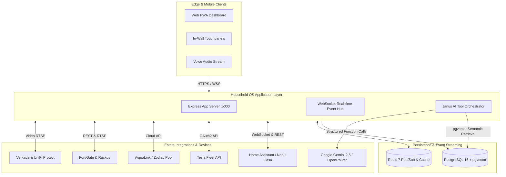

# 🏛️ Household OS (Janus)

<div align="center">

**The open-source, AI-orchestrated estate operating system.**

*IoT automation, multi-agent household coordination, electric vehicle fleet management, and long-term semantic memory in a unified residential command deck.*

[](LICENSE)
[-brightgreen.svg)](.pre-commit-config.yaml)
[](package.json)
[](package.json)
[](tsconfig.json)
[](docker-compose.yml)

[5-Minute Quickstart](QUICKSTART.md) • [System Architecture](ARCHITECTURE.md) • [Customization Guide](docs/CUSTOMIZATION.md) • [Mock Mode](docs/MOCK_MODE.md) • [Roadmap](ROADMAP.md)

</div>

---

## 🌟 Why Household OS?

Most residential smart home platforms (Home Assistant, Homebridge, Apple Home) are great at controlling individual switches, but they stop short of being a **true residential operating system**. 

Household OS bridges the gap between hardware telemetry and daily estate operations:

* 🧠 **Janus Voice AI**: A resident AI orchestrator with long-term semantic memory (`pgvector`) that executes real-world actions across connected hardware.
* 🏡 **Interactive Estate Topology**: 2D property floor plans and irrigation maps with clickable zone pins for lighting, HVAC, and valves.
* 🚗 **Electric Vehicle Fleet**: Real-time Tesla battery telemetry, charge management, and cabin pre-conditioning.
* 🏊 **Hydrology & Pool/Spa**: Water climate schedules, variable speed pump telemetry, and auxiliary water features.
* 🏀 **Community & Sports Hub**: Recurring sports league coordinator with automated RSVPs, waitlists, and court weather contingency alerts.
* 🛡️ **Enterprise Observability**: Real-time monitoring for FortiGate firewalls, Ruckus Wi-Fi, and Verkada/UniFi cameras.
* 🎭 **Batteries-Included Mock Engine**: **No smart home hardware? No problem.** The system automatically simulates telemetry so anyone can run and test the complete app locally.

---

## 📐 System Architecture



---

## ⚡ 5-Minute Quickstart

Get Household OS running locally in 3 commands:

```bash
# 1. Clone repository
git clone https://github.com/tonysafoian/club34-home-app-public.git
cd club34-home-app-public

# 2. Boot backing services (PostgreSQL 16 with pgvector, Redis 7, Mosquitto MQTT)
docker compose up -d

# 3. Configure environment, install dependencies, and launch dev server
cp .env.example .env
npm install
npm run db:push
npm run dev
```

Open **[http://localhost:5000](http://localhost:5000)** in your browser!

> [!TIP]
> **Zero Hardware Required**: With default credentials in `.env`, Household OS runs in **Mock Mode**, generating realistic synthetic telemetry for the dashboard, vehicle fleet, and pool equipment.

---

## 📖 Comprehensive Documentation

| Guide | Description |
| :--- | :--- |
| **[QUICKSTART.md](QUICKSTART.md)** | Step-by-step local setup, Docker containers, and database seeding. |
| **[ARCHITECTURE.md](ARCHITECTURE.md)** | Full technical breakdown of frontend, backend, database schema, and Janus AI. |
| **[CUSTOMIZATION.md](docs/CUSTOMIZATION.md)** | **"Bring Your Own Estate"** — How to customize floor plans, SVG maps, members, and zones. |
| **[MOCK_MODE.md](docs/MOCK_MODE.md)** | Guide to zero-hardware simulation and graceful degradation. |
| **[SETUP.md](SETUP.md)** | Detailed production configuration for external APIs and hardware. |
| **[ROADMAP.md](ROADMAP.md)** | Upcoming features: Local Whisper voice, Matter/Thread, and mobile apps. |

### Subsystem Integration Runbooks
* **[Home Assistant](docs/integrations/home-assistant.md)**: Token creation, WebSocket event streaming, and entity mapping.
* **[Janus Voice AI](docs/integrations/ai-janus.md)**: Gemini 2.5 Flash, OpenRouter, and local Ollama setup.
* **[Vehicle Fleet](docs/integrations/vehicle-fleet.md)**: Tesla Fleet API developer setup, partner keys, and charging control.
* **[Pool & Spa](docs/integrations/pool-spa.md)**: iAquaLink / Zodiac hydrology, heater scheduling, and pump speeds.
* **[Community Sports Hub](docs/integrations/community-ball.md)**: Pickup basketball league coordinator, RSVPs, and weather alerts.
* **[Enterprise Network & Surveillance](docs/integrations/enterprise-network.md)**: FortiGate firewalls, Ruckus APs, and Verkada/UniFi cameras.

### Deployment & Self-Hosting
* **[Homelab & Docker Guide](docs/deployment/homelab-docker.md)**: Deploying on Unraid, Proxmox, TrueNAS, and Raspberry Pi 5.
* **[Cloud Hosting](docs/deployment/cloud-deployment.md)**: One-click deployment to Railway, Fly.io, or Render.
* **[Remote Access & SSL](docs/deployment/reverse-proxy-ssl.md)**: Cloudflare Zero Trust Tunnels, Tailscale, and Caddy.

---

## 🔒 Security & Privacy First

* **Zero Historical Credentials**: Created as a clean slate release branch with zero commit history leaks.
* **Gitleaks Pre-Commit Enforcement**: Configured with `.pre-commit-config.yaml` to prevent future secret commits.
* **Role-Based Access Control**: Strict multi-tiered access (`admin`, `family`, `guest`, `staff`).
* **Local-First Architecture**: Your smart home telemetry remains on your local network and database.

---

## 🤝 Contributing

We welcome contributions from smart home enthusiasts, hardware hackers, and AI developers!
1. Check out our **[Contributing Guidelines](CONTRIBUTING.md)** and **[Code of Conduct](CODE_OF_CONDUCT.md)**.
2. Open a **[Hardware Adapter Request](.github/ISSUE_TEMPLATE/device_adapter_request.md)** to add support for new smart home protocols.
3. Submit a Pull Request adhering to our test and Gitleaks security standards.

---

## 📄 License

This project is open-source under the [MIT License](LICENSE).
