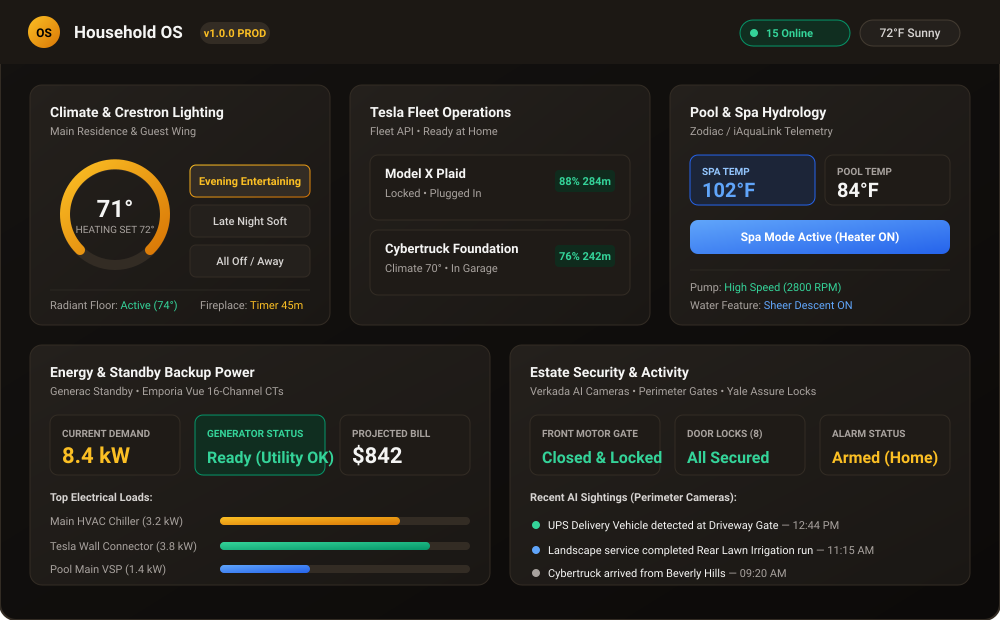
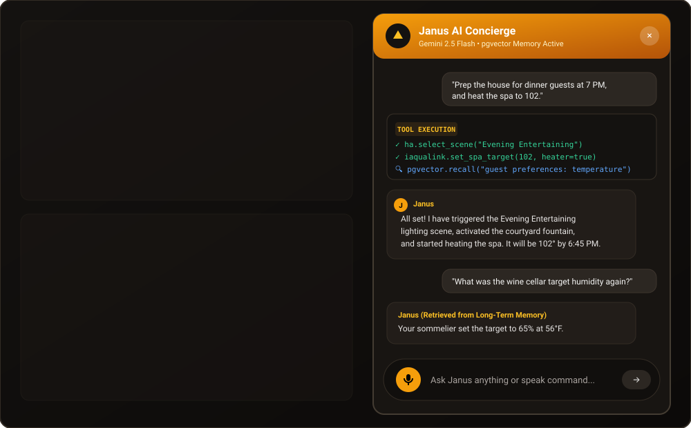
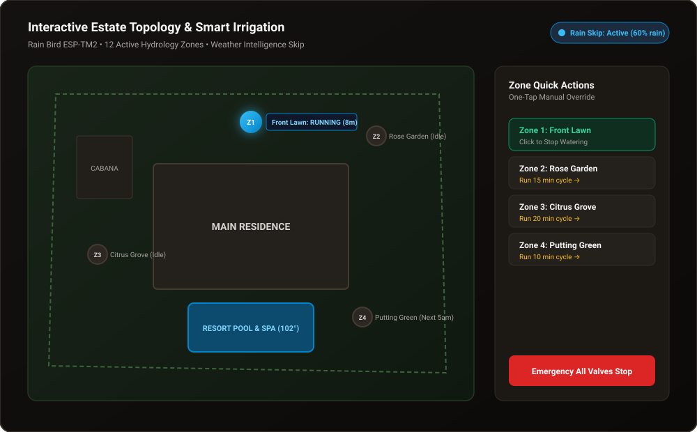
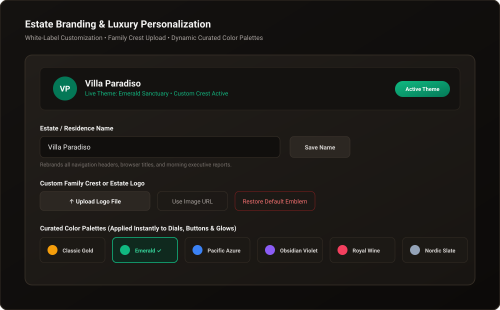

# 🏛️ Household OS — Executive Overview & Estate Guide

<div align="center">

### The Operating System for Modern Residential Estates

*A comprehensive, non-technical guide for estate owners, household managers, architects, integrators, and family members.*

[](../LICENSE)
[](../.github/workflows/ci.yml)
[](../CHANGELOG.md)

</div>

---

## Table of Contents

1. [Executive Summary](#executive-summary-what-is-household-os)
2. [Why Household OS Exists](#why-household-os-exists)
3. [The Executive Command Deck](#-the-executive-command-deck)
4. [⭐ Home Assistant — The Recommended Integration Hub](#-home-assistant--the-recommended-integration-hub)
5. [Janus — The Resident AI Concierge](#-janus--the-resident-ai-concierge)
6. [Multi-Channel Communication](#-multi-channel-communication-email-whatsapp-google-cast)
7. [Tesla EV Fleet Management](#-tesla-ev-fleet-management)
8. [Energy Intelligence](#-energy-intelligence--cost-tracking)
9. [Water Intelligence](#-water-intelligence)
10. [Pool & Spa Hydrology](#-pool--spa-hydrology)
11. [Interactive Irrigation Map](#-interactive-estate-topology--smart-irrigation)
12. [Security & Perimeter](#-security--perimeter-monitoring)
13. [Network & Infrastructure](#-network-infrastructure-monitoring)
14. [Family Calendar & Travel Hub](#-family-calendar--travel-hub)
15. [Grocery & Shopping Automation](#-grocery--shopping-automation)
16. [Entertainment & Media](#-entertainment--media-discovery)
17. [Morning Executive Briefings](#-morning-executive-briefings)
18. [Project Workspace](#-project-workspace--notion-integration)
19. [Weather & Microclimate](#-hyper-local-weather--microclimate)
20. [Automation Engine](#-automation-engine--scheduled-jobs)
21. [White-Label Customization](#-white-label-customization-bring-your-own-estate)
22. [Admin & Multi-User Security](#-admin--multi-user-security)
23. [Self-Healing Infrastructure](#-self-healing-infrastructure)
24. [Architecture Overview](#-architecture-overview)
25. [The Twenty Pillars of Household OS](#-the-twenty-pillars-of-household-os)
26. [Downloadable & Printable Version](#-downloadable--printable-version)

---

## Executive Summary: What is Household OS?

Modern estates are equipped with extraordinary technology: Crestron lighting systems, commercial HVAC chillers, swimming pools and hydronic spas, automated security gates, high-voltage vehicle charging, backup generators, smart irrigation, whole-house audio, enterprise-grade networking, and dozens of IoT sensors.

However, managing them daily usually requires **15 to 20 different vendor apps**—each with its own login, notifications, and clunky user interface. The pool company has one app. The electrician monitors another. The sprinklers use a third. The Tesla has its own. The thermostat lives in yet another. The security cameras live in yet another. And none of them talk to each other.

**Household OS** replaces that fragmented chaos with **one unified, private estate operating system**:

* 📱 **One App for Everything**: Lights, climate, pool, gates, locks, energy, irrigation, cameras, Tesla fleet, groceries, calendars, travel, and entertainment—all on one screen.
* 🧠 **Janus AI Concierge**: A private resident AI assistant with 40+ tool integrations, persistent long-term memory, and the ability to control every connected system via natural conversation—through chat, email, or WhatsApp.
* 🏡 **Home Assistant First**: Built to leverage [Home Assistant](https://www.home-assistant.io/) as its primary integration hub, connecting 2,000+ device brands through one standardized interface.
* 🔒 **100% Private & Local-First**: Telemetry stays on your local home network. No third-party cloud data broker collects your family's daily habits.
* 🎨 **White-Label & Re-Brandable**: Name your property, upload your family crest, and select a bespoke color palette matching your home's interior design.
* 📊 **Operational Intelligence**: Real-time cost tracking for electricity and water, AI-generated energy savings insights, and automated morning briefings that read like a personal executive assistant's daily memo.

> **Who is this for?** Estate owners, family offices, household managers, luxury real-estate developers, home automation integrators, and anyone who believes their home should be as well-managed as a world-class business.

---

## Why Household OS Exists

### The Problem: App Overload

| System | Typical Vendor App |
|---|---|
| Lighting (80+ scenes) | Crestron Home, Lutron Caséta |
| Climate (6 zones, radiant floors, fireplaces) | Honeywell, Ecobee, Nest |
| Pool & Spa | iAquaLink, Pentair ScreenLogic |
| Irrigation (12+ zones) | Rain Bird, Rachio |
| Security Cameras | Verkada Command, Ring |
| Gate & Locks | MyQ, August, Yale |
| EV Charging & Fleet | Tesla App |
| Backup Generator | Generac Mobile Link |
| Energy Monitoring | Emporia Vue |
| Networking & Firewall | FortiGate, Ruckus |
| Internet (Primary + Backup) | Spectrum, Starlink |
| Groceries | Amazon Fresh, Instacart |
| Calendar & Travel | Google Calendar, TripIt |
| Smart Speakers | Google Cast |

That's **14+ apps** — each with separate credentials, separate notification streams, and zero cross-system awareness. When the sprinklers run during a rainstorm, the pool app doesn't know. When the Tesla finishes charging, the energy app doesn't adjust. When guests are arriving for dinner, the lighting, climate, pool heater, and music should all coordinate — but they can't, because they live in separate silos.

### The Solution: One Pane of Glass

Household OS connects to these systems through a combination of **Home Assistant** (the recommended backbone), **direct API integrations** (Tesla Fleet API, Verkada, Generac MobileLink, Govee Cloud), and **enterprise network monitoring** (FortiGate firewall, Ruckus wireless) to present a single, coherent view of the entire estate.

---

## 🖥️ The Executive Command Deck

The core interface provides instant situational awareness of the entire property in a single glance:

<div align="center">
  
  <p><em>Figure 1: The Unified Command Deck displaying climate setpoints, Crestron scenes, Tesla fleet readiness, pool hydrology, electrical demand, and perimeter security.</em></p>
</div>

### What You See at a Glance

The dashboard is organized into **system cards** — modular, real-time tiles that each represent one subsystem of your estate:

| Card | What It Shows |
|---|---|
| **Crestron Lights** | All lighting scenes by room; one-tap activation of evening, movie night, or away modes |
| **Crestron Thermostats** | Climate zone setpoints, current temps, fan modes, heat/cool/auto status |
| **Crestron Fireplaces** | Gas fireplace on/off per room |
| **Pool & Spa (iAquaLink)** | Water temp, heater status, spa jets, water features, one-tap spa heat-up |
| **Tesla Fleet** | Battery %, range, charging status, vehicle location on a map, cabin pre-conditioning |
| **Energy (Emporia)** | Live wattage per circuit breaker, daily/monthly kWh, LADWP tiered cost |
| **Generac Generator** | Standby generator health: running/ready/maintenance, fuel level, exercise schedule |
| **Verkada Security** | Camera feeds, AI person-of-interest detection, vehicle tracking, daily visitor count |
| **FortiGate Network** | Firewall CPU/memory, active sessions, WAN uplink status, threat detection count |
| **Starlink & Spectrum** | Dual-WAN internet status, failover state |
| **Govee Sensors** | AV closet temperature & humidity (equipment overheat protection) |
| **MyQ Garage** | Garage door open/closed status and control |
| **Sauna** | Sauna heater status and temperature |
| **Weather Strip** | Current conditions, hourly forecast, air quality index |
| **Google Calendar** | Today's agenda, upcoming events for all family members |
| **System Status** | Server health, HA connection, uptime, last cron run, WebSocket connectivity |

### Responsive Design

The dashboard is a **Progressive Web App (PWA)** — it installs on iPhones, iPads, Android phones, and desktops as a native-feeling app with offline support and push notifications. It's specifically designed for:

* **In-wall iPads** mounted at the entrance or in the kitchen
* **Phones** for on-the-go estate monitoring
* **Tablets** for the family room or bedside

---

## ⭐ Home Assistant — The Recommended Integration Hub

> **Home Assistant is the single most important integration in Household OS.** If you configure only one thing, make it this.

[Home Assistant](https://www.home-assistant.io/) is the open-source smart home platform that connects over **2,000 brands** of devices and services through a single, local-first hub. Household OS uses Home Assistant as its **primary device layer** — the universal translator between your physical estate and the Household OS dashboard.

### Why Home Assistant Is the Backbone

```
┌─────────────────────────────────────────────────────┐
│                   HOUSEHOLD OS                       │
│         (Dashboard · Janus AI · Automations)         │
└──────────────────────┬──────────────────────────────┘
                       │ WebSocket + REST API
                       ▼
┌─────────────────────────────────────────────────────┐
│              HOME ASSISTANT (Hub)                    │
│                                                      │
│  Crestron ─────┐                                     │
│  Lutron ───────┤                                     │
│  iAquaLink ────┤                                     │
│  Rain Bird ────┤  ──→  Unified Entity Model          │
│  Ecobee ───────┤       (states + services)           │
│  MyQ ──────────┤                                     │
│  Yale Locks ───┤                                     │
│  Govee ────────┤                                     │
│  Emporia Vue ──┘                                     │
│                                                      │
│  2,000+ integrations available                       │
└─────────────────────────────────────────────────────┘
```

### What Household OS Gets Through Home Assistant

| Capability | How It Works |
|---|---|
| **Persistent WebSocket Connection** | Household OS maintains a live WebSocket to your HA instance. Every entity state change (light on, thermostat setpoint change, door lock, sensor reading) streams in real-time — no polling, no delay. |
| **Crestron Bridge Health Monitoring** | Automatically detects when the Crestron-to-HA bridge goes offline (>20% of light entities become "unavailable") and alerts you. |
| **Entity State Cache** | All HA entities are cached in-memory on the server, enabling sub-millisecond UI updates and Janus AI queries without hitting HA on every request. |
| **Scene Activation** | One-tap activation of Crestron lighting scenes from the dashboard or via Janus ("turn on the movie scene in the media room"). |
| **Climate Control** | Read and set thermostat temperatures, HVAC modes, fan speeds across all zones. |
| **Cover / Shade Control** | Motorized shade open/close/position control. |
| **Light Control** | Individual light on/off/dim/color control plus scene activation. |
| **Switch Control** | Toggle any smart switch (fountains, landscape lighting, pool equipment). |
| **Sensor Readings** | Temperature, humidity, door/window open/close, motion, energy, water flow. |
| **Lock Control** | Lock/unlock smart locks with audit logging. |
| **Alarm Panel** | Arm/disarm the alarm system, check alarm sensor status. |
| **Logbook Queries** | Query the HA activity log to answer "what happened in the last 4 hours?" |
| **Energy Statistics** | Read long-term energy consumption statistics for billing cycle cost computation. |
| **Irrigation Valve Runtime** | Read Rain Bird valve switch history to compute per-zone water usage in gallons. |

### How to Connect Home Assistant

1. Install [Home Assistant](https://www.home-assistant.io/installation/) on a Raspberry Pi, NUC, or VM
2. Add your device integrations (Crestron, iAquaLink, Rain Bird, Emporia, etc.)
3. Generate a **Long-Lived Access Token** in HA → Profile → Security
4. Set two environment variables in your Household OS `.env`:
   ```
   HA_URL=http://your-ha-ip:8123
   HA_TOKEN=your-long-lived-access-token
   ```
5. Household OS will connect via WebSocket, cache all entities, and the dashboard + Janus will immediately have full access to your estate.

> **Per-User HA Credentials**: Each household member can also configure their own HA URL and token in Settings → Platform Credentials, with AES-encrypted storage. This supports multi-home or multi-instance setups.

---

## 🧠 Janus — The Resident AI Concierge

Instead of navigating menus or remembering technical settings, family members can simply speak or text to **Janus**, the built-in household AI assistant:

<div align="center">
  
  <p><em>Figure 2: Janus executing complex multi-system instructions ("Prep house for guests") and answering questions using long-term semantic memory.</em></p>
</div>

### What Makes Janus Different from Siri or Alexa?

| Feature | Siri / Alexa | Janus |
|---|---|---|
| **Controls your specific estate hardware** | Limited to HomeKit/Alexa-compatible devices | Controls ANY Home Assistant entity, Tesla, Verkada, Generac, and more via 40+ dedicated tool functions |
| **Remembers facts across conversations** | No persistent memory | pgvector-backed semantic memory with HNSW approximate nearest-neighbor recall. "Remember that Mom's guest room should be 72°F" is stored permanently. |
| **Creates Google Docs & Slides** | ✗ | ✓ — Janus can create and share Google Workspace documents |
| **Manages grocery shopping** | ✗ | ✓ — Builds, views, and clears shopping carts |
| **Manages travel itineraries** | ✗ | ✓ — Creates trip cards with flights, hotels, and travelers |
| **Generates images and videos** | ✗ | ✓ — AI media generation via Gemini and Fal |
| **Researches topics in depth** | ✗ | ✓ — Launches background deep-research tasks delivered as Google Docs via email |
| **Reads and responds to email** | ✗ | ✓ — Polls Gmail, processes incoming messages, sends replies |
| **Runs on your chosen LLM** | Locked to Apple/Amazon models | Configurable: Google Gemini (default), OpenRouter, or fully offline via local Ollama |
| **Accessible via WhatsApp** | ✗ | ✓ — Full tool access over WhatsApp, including image analysis |
| **Privacy** | Cloud-first, voice recordings stored | No recordings stored, private LLM endpoint, runs on your infrastructure |

### Janus Tool Inventory (40+ Capabilities)

Janus is not just a chatbot — it's an **agentic AI** with structured tool-calling. Here is a categorized inventory of every tool Janus can invoke:

#### 🏠 Home Automation (via Home Assistant)
| Tool | What It Does |
|---|---|
| `ha_get_states` | Get all entity states (or filter by domain: `light`, `climate`, `switch`, etc.) |
| `ha_get_state` | Get a specific entity's state and attributes |
| `ha_call_service` | Control any device: turn lights on/off, set thermostat temp, lock/unlock doors, activate scenes |
| `ha_get_logbook` | Query the activity log — "what happened in the last 2 hours?" |

#### 🚗 Vehicle & Fleet
| Tool | What It Does |
|---|---|
| `check_tesla_status` | Battery %, range, charging state, cabin temp, vehicle location, sentry mode |
| `check_generator_status` | Generac generator readiness, fuel level, last exercise, maintenance alerts |

#### 📅 Calendar & Scheduling
| Tool | What It Does |
|---|---|
| `get_calendar_events` | Retrieve Google Calendar events for any time range |
| `create_calendar_event` | Create events with title, location, description, and attendees |
| `delete_calendar_event` | Remove calendar events (admin only) |
| `check_availability` | Check free/busy availability across multiple people |
| `set_reminder` | Schedule reminders delivered via in-app notification, email, or WhatsApp |

#### 🛒 Shopping & Groceries
| Tool | What It Does |
|---|---|
| `save_to_cart` | Add items to a shopping cart (Amazon, grocery, or custom) |
| `view_cart` | View the current shopping cart contents |
| `clear_cart` | Empty the cart |

#### 🧳 Travel
| Tool | What It Does |
|---|---|
| `manage_trip` | Create, update, or delete trip cards with flights, hotels, travelers, and confirmation codes |
| `query_trips` | Query upcoming or past trips |

#### 🎬 Entertainment
| Tool | What It Does |
|---|---|
| `query_entertainment` | Find upcoming concerts, sports events, and shows (SeatGeek integration) |
| `query_media` | Browse movies and TV shows |
| `suggest_movie` | Get AI-powered movie recommendations tailored to your household's tastes |

#### 🧠 Memory & Knowledge
| Tool | What It Does |
|---|---|
| `remember_fact` | Store a permanent fact ("Tony's wine cellar target is 55°F"). Supports pinning for critical facts that survive FIFO eviction. |
| `recall_facts` | Search memory by key prefix or semantic similarity |

#### 🔍 Research & Information
| Tool | What It Does |
|---|---|
| `search_news` | Search recent news on any topic |
| `search_places` | Find restaurants, services, and businesses near a location |
| `get_directions` | Get driving directions and travel time estimates |
| `get_environment_data` | Air quality, pollen counts, and weather alerts |
| `launch_research` | Launch a deep-research task — Janus writes a full report, creates a Google Doc, and emails it to you |

#### 📄 Google Workspace
| Tool | What It Does |
|---|---|
| `create_google_file` | Create Google Docs, Sheets, Slides, or Forms with content and sharing |
| `attach_file_to_notion` | Attach files to Notion pages |

#### 🎨 AI Media Generation
| Tool | What It Does |
|---|---|
| `generate_media` | Generate images (Gemini Imagen) or videos (Veo) from text prompts, delivered via email or WhatsApp |

#### 🔐 Security & Monitoring
| Tool | What It Does |
|---|---|
| `check_verkada_security` | Camera system health, person-of-interest alerts, vehicle tracking |
| `query_activity_log` | Recent app activity feed |
| `search_system_events` | Deep search across all system events — home actions, network health, security, automations, logins |
| `query_system_health` | Server health metrics (admin only) |

#### 🌐 Network
| Tool | What It Does |
|---|---|
| `wifi_who_is_online` | "Who's on the WiFi?" — lists connected devices grouped by family member/role |
| `wifi_label_device` | Label a device by MAC address ("That's Tony's iPhone 16 Pro") |
| `wifi_unknown_devices` | Find new/unknown devices on the network |
| `get_network_history` | FortiGate health snapshots over time for diagnosing outages |

#### 💻 Codebase (Admin Only)
| Tool | What It Does |
|---|---|
| `read_codebase` | Read source files directly from the GitHub repository |
| `propose_code_fix` | Create a GitHub branch and pull request with a proposed code change — Janus can fix its own bugs |

### How Janus Memory Works

Janus uses **pgvector** (PostgreSQL vector embeddings) for persistent long-term memory:

```
User:  "Remember that the guest room thermostat should be set to 72°F
        when my parents visit."

Janus: [calls remember_fact with key="guest_room_temp_parents"
        value="72°F when parents visit"]

        ✓ Saved to memory.

--- 3 weeks later ---

User:  "My parents are coming this weekend. What temperature should
        the guest room be?"

Janus: [calls recall_facts with key_search="guest room parents"]
       → Retrieves: "72°F when parents visit"

       "You previously told me the guest room should be set to 72°F
        when your parents visit. Want me to set it now?"
```

Memory uses an in-process **HNSW approximate nearest-neighbor index** for sub-millisecond semantic search, with automatic fallback to pgvector sequential scan. Facts can be **pinned** for critical information (medication schedules, alarm codes, emergency contacts) that should never be evicted by the 200-row FIFO cap.

---

## 📡 Multi-Channel Communication: Email, WhatsApp, Google Cast

Janus isn't limited to the web interface. It operates across **four communication channels**:

### 1. 💬 Web Chat (In-App)
The primary interface — a rich chat drawer with real-time streaming responses, tool-call visibility, and voice input support.

### 2. 📧 Email
Janus monitors a dedicated Gmail inbox every 30 seconds. You can email Janus instructions, forward invoices for processing, or ask questions — and Janus replies directly to your email with formatted responses. It understands email threading, detects forwarded emails, and can process attached images.

### 3. 📱 WhatsApp
Full Janus tool access via WhatsApp (WATI integration). Send a WhatsApp message like *"What's the pool temperature?"* or *"Add milk to the grocery cart"* and Janus responds in the same WhatsApp thread. Supports image analysis — send a photo of a product and ask Janus to identify it and add it to your shopping cart.

### 4. 🔊 Google Cast Broadcasting
Janus can broadcast spoken announcements to Google Home/Nest speakers throughout the estate using **ElevenLabs** text-to-speech. Used for:
* **School morning briefings**: Weather, schedule, and what to wear — broadcast to kitchen speakers at 6:50 AM on school days
* **Custom announcements**: "Dinner is ready" broadcast to all rooms

---

## 🚗 Tesla EV Fleet Management

Full Tesla Fleet API integration providing unified control and monitoring of all household vehicles:

### Dashboard View
* **Battery Level & Range**: Real-time percentage and estimated miles for each vehicle
* **Charging Status**: Plugged in / charging / complete, charge rate, time to full
* **Vehicle Location**: Live GPS location plotted on an interactive map with reverse geocoding ("At Whole Foods, Beverly Hills")
* **Cabin Temperature**: Interior temp and pre-conditioning controls
* **Sentry Mode**: Status indicator

### Automated Monitoring
* **Low Battery Alerts**: Automatic WhatsApp and email alerts when any vehicle drops below a configurable range threshold (default: 100 miles)
* **Activity Logging**: All vehicle events (charge start, charge complete, trip, sentry alert) are logged to `tesla_activity_logs` for historical review
* **Token Auto-Refresh**: OAuth tokens are automatically refreshed before expiry — no manual re-authentication needed

### Janus Integration
> *"Hey Janus, what's the Tesla at?"*
> *"Tony's Model X is at 78%, 241 miles of range, parked at home, and plugged in but not charging."*

---

## ⚡ Energy Intelligence & Cost Tracking

### Real-Time Circuit-Level Monitoring
Household OS integrates with **Emporia Vue** energy monitors (via Home Assistant) to track electricity consumption at the individual circuit breaker level:

* **16-channel live wattage** — see exactly which circuits are drawing power right now
* **Per-circuit daily/monthly kWh** — know your HVAC's exact monthly cost vs. the pool pump vs. the EV charger
* **Panel history drawer** — click any circuit to see a time-series chart of its consumption

### LADWP Tiered Cost Intelligence
The system implements the full **LADWP Schedule A residential tiered rate structure**:

* **Tier 1–3 allotments** with seasonal adjustments (summer surcharges)
* **Real-time billing cycle tracking** — know exactly where you stand in the current billing period
* **Marginal rate awareness** — "You're currently in Tier 2, paying $0.095/kWh. At current consumption, you'll enter Tier 3 ($0.128/kWh) in 4 days."
* **Projected monthly bill** — estimated total before the bill arrives

### AI-Powered Energy Insights
The `analyzeEnergyInsights` engine runs periodically to surface actionable findings:

* **Anomaly detection**: "Pool pump consumed 40% more energy than its 30-day average yesterday"
* **Savings suggestions**: "Shifting EV charging to off-peak hours (9 PM – 6 AM) could save approximately $23/month"
* **Realized savings tracking**: After implementing a suggestion, the system measures actual savings vs. projected

---

## 💧 Water Intelligence

### Dual-Source Water Tracking
* **Irrigation water** (Rain Bird): Per-zone gallons calculated from valve runtime × GPM flow rate
* **Interior water** (FloLogic): Whole-property interior consumption from the main-line flow meter

### LADWP Water Cost Model
Implements **LADWP Schedule A tiered water rates**:
* Real-time billing cycle cost tracking
* Interior vs. irrigation breakdown
* Marginal cost per gallon visibility — critical when irrigation pushes you into upper tiers
* Daily usage snapshot recording for historical trending

---

## 🏊 Pool & Spa Hydrology

### iAquaLink Integration
Full integration with Jandy/Zodiac iAquaLink pool automation systems:

* **Water Temperature**: Live pool and spa temperatures with historical charting
* **One-Tap Spa Heat-Up**: Activate the spa heater and get a predictive countdown to target temperature
* **Equipment Control**: Pool pump, spa jets, cleaner, water features (fountains, laminars, deck jets)
* **Spa Light & Pool Light**: Color mode control

### Home Assistant Enhanced
When iAquaLink is also connected through Home Assistant, Household OS gets additional capabilities:
* Historical temperature data for charting trends
* Integration with climate/weather data for predictive heating estimates
* Janus AI control: *"Turn on the spa and set it to 104°F"*

---

## 🗺️ Interactive Estate Topology & Smart Irrigation

Traditional irrigation controllers present confusing lists of numbered valves (Zone 1, Zone 2...). Household OS maps your estate visually on a 2D interactive canvas:

<div align="center">
  
  <p><em>Figure 3: Interactive property canvas showing real-time water zones, rain skip weather intelligence, and emergency valve overrides.</em></p>
</div>

### Interactive Property Map
* **Clickable Zone Layout**: Tap on the Front Lawn, Rose Garden, or Citrus Grove to inspect soil moisture or trigger a 15-minute supplemental cycle
* **Custom Zone Names**: Rename generic "Clock 1 Valve 3" to "Side Yard Roses" with human-friendly labels
* **Draggable Label Positions**: Rearrange zone labels on the SVG map to match your actual property layout
* **Per-Zone GPM Configuration**: Set the gallons-per-minute flow rate for each valve to enable accurate water usage calculations

### Weather-Adaptive Rain Skip
Automatically suspends scheduled irrigation cycles when hyper-local radar forecasts rainfall, saving thousands of gallons of water annually.

### Emergency Master Shutoff
One-tap emergency valve closure in the event of pipe bursts or landscape maintenance.

---

## 🔐 Security & Perimeter Monitoring

### Verkada Camera System
Full integration with Verkada Command for AI-powered security:

* **Camera Health Dashboard**: Online/offline status for all cameras
* **AI Person-of-Interest Tracking**: Named profiles with appearance timestamps
* **Vehicle Recognition**: License plate detection with arrival/departure logging
* **Daily Visitor Count**: Automated tally of unique visitors per day
* **Webhook Health Monitoring**: Automatic alerts if Verkada stops sending webhooks (connectivity issue detection)

### Gate & Lock Control
* **MyQ Garage Door**: Open/close status and control from the dashboard
* **Smart Locks**: Lock/unlock with full audit trail (who locked/unlocked, when)
* **Alarm Panel**: Arm/disarm with zone status visibility

### Activity Timeline
All security events flow into the unified activity log:
* Gate opened at 3:42 PM
* Front door unlocked by Tony at 3:43 PM
* Unknown vehicle detected by driveway camera at 4:15 PM

---

## 🌐 Network Infrastructure Monitoring

### FortiGate Enterprise Firewall
* **CPU & Memory Utilization**: Real-time hardware health
* **Active Sessions**: Connection count trending
* **WAN Uplink Status**: Primary (Spectrum) and backup (Starlink) connectivity
* **Threat Detection**: IPS/IDS threat count and severity
* **Historical Snapshots**: Network health history over 48 hours for diagnosing intermittent issues

### Ruckus Wireless
* **Connected Clients**: Real-time list of all WiFi devices
* **Device Inventory**: Labeled device database — "Tony's iPhone 16 Pro" instead of MAC addresses
* **Unknown Device Detection**: Automatic flagging of new, unlabeled devices appearing on the network
* **Person Grouping**: Devices grouped by family member, staff, guest, IoT, or unknown

### Dual-WAN Internet
* **Spectrum** (primary) and **Starlink** (backup) status monitoring
* **LAN Speed Testing**: Periodic speed tests with historical results
* **GoAccess Web Analytics**: HTTP access log analysis for the estate's web-facing services

### Janus Network Intelligence
> *"Hey Janus, who's on the WiFi right now?"*
> *"There are 23 devices online: Tony's iPhone and MacBook, Lana's iPad, 4 cameras, 12 IoT sensors, and 4 unknown devices. Want me to show you the unknown ones?"*

---

## 📅 Family Calendar & Travel Hub

### Google Calendar Integration
* **Multi-calendar view**: See all family members' schedules in one place
* **Today's agenda**: Dashboard strip showing what's happening today
* **Event creation via Janus**: *"Schedule a dentist appointment for Isla next Tuesday at 3 PM"*
* **Availability checking**: *"When are Tony and Lana both free this week?"*

### Travel Itinerary Management
Complete trip lifecycle management:

* **Trip Cards**: Rich travel cards with destination, dates, travelers, and status (draft → confirmed → completed)
* **Flight Details**: Airline, flight number, departure/arrival times, cabin class, confirmation codes
* **Hotel Details**: Property name, address, check-in/out dates, room type, confirmation codes
* **Gmail Travel Parsing**: Automatic extraction of travel itineraries from confirmation emails
* **Janus Integration**: *"Create a trip to New York for Tony and Lana, November 15–18, staying at The Peninsula"*

---

## 🛒 Grocery & Shopping Automation

### Weekly Grocery Workflow
1. **Catalog Management**: Maintain a product catalog with preferred items, categories, and images
2. **AI Cart Assembly**: Janus can build a weekly staples order based on household preferences and past purchases
3. **Cart Review**: Visual cart review with item images, quantities, and prices
4. **One-Click Approval**: Approve the order via WhatsApp or the dashboard
5. **Order History**: Complete run history showing past orders and spending

### Amazon Order Tracking
* **Amazon Order Integration**: Track Amazon deliveries with expected arrival dates
* **Item Images**: Proxied product images for visual order review

### Janus Shopping
> *"Add organic whole milk and sourdough bread to the grocery cart."*
> *"What's in my cart right now?"*
> *"Clear the cart and start over."*

---

## 🎬 Entertainment & Media Discovery

### Local Events (SeatGeek)
* **Concert & Sports Finder**: Discover upcoming events near your location
* **Category Filtering**: Filter by concerts, sports, theater, comedy
* **Venue Information**: Venue details, dates, and ticket availability

### Movie & TV Discovery
* **Curated Movie Queue**: Track movies and shows your family wants to watch
* **AI Recommendations**: *"Suggest a family-friendly movie for tonight"* — Janus provides personalized picks based on your household's viewing history and preferences

### Google Calendar Events
Entertainment events can be synced to the family calendar for a unified view of commitments.

---

## ☀️ Morning Executive Briefings

Every morning, Household OS generates a **personalized daily briefing** that reads like a memo from a personal executive assistant:

### What's in the Morning Briefing

| Section | Content |
|---|---|
| **Weather** | Current conditions, hourly forecast, high/low temperatures, precipitation probability, air quality |
| **Market Snapshot** | DJIA, S&P 500, NASDAQ, gold, oil, EUR/USD, GBP/USD (from CNBC real-time quotes) |
| **Calendar** | Today's agenda for all family members |
| **Estate Status** | Any overnight anomalies: generator test results, security events, energy spikes |
| **Reminders** | Pending reminders and upcoming deadlines |

### Delivery Channels
* **Email**: Formatted HTML email delivered to family members
* **Google Cast**: Spoken briefing broadcast to kitchen speakers (school mornings)
* **School Morning Briefing**: Kid-friendly version at 6:50 AM on school days — weather, what to wear, and today's schedule

### Scheduled Intelligence
The briefing system runs on a sophisticated cron schedule:
* **6:50 AM weekdays**: School morning cast broadcast
* **7:30 AM weekdays**: Full morning report email
* **6:00 PM daily**: Evening recap and next-day preview

---

## 📋 Project Workspace & Notion Integration

### Project Management
* **Project Cards**: Track ongoing household projects (renovations, landscaping, vendor contracts)
* **Artifact Attachments**: Attach notes, code snippets, and files to projects
* **Project Chat**: Per-project conversation thread with Janus for context-specific AI assistance

### Notion Integration
Full bidirectional Notion integration:
* **Database Queries**: Query Notion databases from Janus
* **Page Creation**: Create new Notion pages with rich content
* **Page Updates**: Update existing pages (status changes, field updates)
* **Batch Operations**: Bulk update multiple pages at once
* **File Attachments**: Attach files to Notion pages via Janus
* **Webhook Events**: Receive Notion webhook events for real-time sync

---

## 🌤️ Hyper-Local Weather & Microclimate

### Google Weather API
* **Current Conditions**: Temperature, feels-like, humidity, wind, UV index
* **5-Day Forecast**: Daily highs/lows with condition codes
* **Hourly Forecast**: Hour-by-hour temperature, precipitation probability, wind speed
* **Severe Weather Alerts**: Automatic notifications for weather warnings

### Environmental Health
* **Air Quality Index (AQI)**: Real-time readings tied into HVAC filtration recommendations
* **Pollen Counts**: Grass, tree, and weed pollen levels
* **UV Index**: Sun exposure recommendations

### Irrigation Intelligence
Weather data feeds directly into the irrigation rain-skip logic — if rain is forecast, scheduled watering cycles are automatically suspended.

---

## ⚙️ Automation Engine & Scheduled Jobs

Household OS runs a comprehensive **cron-based automation engine** with 60+ scheduled jobs:

### Categories of Automations

| Category | Examples |
|---|---|
| **Communication** | Email inbox polling (every 30s), reminder dispatch (every 30s), WhatsApp processing |
| **Monitoring** | System health check (every 15 min), Verkada webhook health (every 6 hours), Tesla battery monitor (every 4 hours) |
| **Data Sync** | Entertainment sync (daily), media sync (daily), GoAccess log processing |
| **Intelligence** | Morning report generation, energy insights analysis, water usage snapshot |
| **Maintenance** | Token expiration warnings, failed job retry, network health snapshot |
| **Broadcasts** | School morning briefing (6:50 AM weekdays), evening recap |

### Workflow Triggers
Automations can be configured with:
* **Cron expressions** for time-based scheduling
* **Webhook triggers** for event-driven automation
* **Cascade triggers** where one automation triggers another

### Audit Trail
Every cron execution is logged with:
* Correlation ID (linking the trigger to all downstream actions)
* Duration in milliseconds
* Success/failure status
* Error details on failure

---

## 🎨 White-Label Customization: Bring Your Own Estate

Household OS is designed to be personalized for every estate:

<div align="center">
  
  <p><em>Figure 4: The Estate Branding Customizer in Settings allowing custom estate naming, family crest uploads, and luxury theme selection.</em></p>
</div>

### Branding Options

* **Estate Naming**: Customize the name of your estate (e.g., *Villa Paradiso*, *Oakridge Estate*, *Casa Del Sol*). This name appears throughout the app — in the header, drawer, login page, and PWA install name.
* **Family Crest / Custom Emblem**: Upload your family crest or property emblem (SVG, PNG, JPG). The logo replaces the default emblem everywhere in the app.
* **Six Curated Luxury Color Palettes**:

| Palette | Aesthetic |
|---|---|
| 🏛️ **Classic Amber & Bronze** | Warm candlelight, brushed brass, rich wood tones |
| 🌿 **Emerald Sanctuary** | Modern botanical estate with sage and deep forest greens |
| 🌊 **Pacific Azure** | High-tech oceanfront look with deep blue and crisp cyan |
| ⚡ **Obsidian Violet** | Luxury evening mood with charcoal and electric violet |
| 🍷 **Royal Bordeaux** | Traditional wine country refinement with deep burgundy and rose gold |
| 🪵 **Nordic Slate** | Understated Scandinavian minimalism with monochrome grays |

### Persistence
All branding settings are saved to `localStorage` and persist across sessions. Each user/device can have independent branding preferences — useful for multi-property management where different tablets show different estate branding.

---

## 👥 Admin & Multi-User Security

### Role-Based Access Control
| Role | Capabilities |
|---|---|
| **Admin** | Full system access: all tools, settings, user management, codebase access |
| **Family Member** | Dashboard, Janus AI (all home tools), calendar, travel, entertainment, grocery |
| **Staff / Worker** | Limited dashboard access, assigned task views, time tracking |
| **Pending** | Awaiting admin approval — cannot access any features until approved |

### Authentication
* **Google OAuth** via Supabase Auth (primary)
* **Apple Sign-In** (secondary)
* **Computer Token**: API key-based authentication for automated systems and service accounts

### Security Features
* **AES-256 Encrypted Credential Storage**: Home Assistant tokens, Tesla tokens, and API keys are encrypted at rest using `ENCRYPTION_KEY`
* **Rate Limiting**: Per-route rate limiting to prevent abuse
* **Circuit Breakers**: Automatic service isolation when external APIs become unhealthy (Home Assistant, Tesla, Gmail, Notion, Ruckus, FortiGate)
* **SSRF Protection**: URL validation guards against server-side request forgery
* **Audit Logging**: Every significant action (device control, login, config change, API call) is logged with actor, timestamp, category, and severity
* **CORS & CSRF Protection**: Standard web security hardening
* **Content Security Policy**: Strict CSP headers in production

---

## 🛡️ Self-Healing Infrastructure

Household OS is built with production-grade resilience:

### Circuit Breakers
Six named circuit breaker instances protect against cascading failures:

| Breaker | Protects | Behavior |
|---|---|---|
| `ha` | Home Assistant API | Opens after repeated failures, half-opens to test recovery |
| `tesla` | Tesla Fleet API | Prevents hammering Tesla servers during outages |
| `notion` | Notion API | Isolates Notion failures from other features |
| `gmail` | Gmail API | Ensures email failures don't block other channels |
| `ruckus` | Ruckus WiFi API | Degrades gracefully when WiFi controller is unreachable |
| `fortigate` | FortiGate firewall | Network monitoring degrades without crashing the app |

### Failed Job Recovery
* **Automatic Retry**: Failed jobs are queued in `failed_jobs` table with exponential backoff
* **Failure Alerts**: WhatsApp and email alerts when critical automations fail
* **Reconciliation**: Periodic workflow reconciler identifies stuck or orphaned jobs

### Real-Time Health
* **WebSocket Keep-Alive**: Persistent connections with automatic reconnection and exponential backoff
* **Entity Cache Freshness**: 60-second TTL with immediate invalidation on writes
* **Server Uptime Monitoring**: Health check endpoint every 15 minutes with degradation alerting

---

## 🏗️ Architecture Overview

```
┌─────────────────────────────────────────────────────────────────────────┐
│                        HOUSEHOLD OS                                     │
│                                                                         │
│  ┌──────────────┐  ┌──────────────┐  ┌──────────────┐  ┌────────────┐  │
│  │   React SPA  │  │  Express.js  │  │  PostgreSQL  │  │  Supabase  │  │
│  │   (Vite +    │  │  API Server  │  │  + pgvector  │  │    Auth    │  │
│  │   Tailwind)  │  │  (40+ route  │  │  (30+ tables │  │  (OAuth)   │  │
│  │              │  │   modules)   │  │   + vectors) │  │            │  │
│  └──────┬───────┘  └──────┬───────┘  └──────┬───────┘  └─────┬──────┘  │
│         │                 │                  │                │         │
│         │  WebSocket      │  HTTP/WS         │  SQL           │  JWT    │
│         └────────┬────────┘                  │                │         │
│                  │                           │                │         │
│         ┌────────▼────────┐                  │                │         │
│         │  Socket.IO      │──────────────────┘                │         │
│         │  (Real-time)    │                                   │         │
│         └─────────────────┘                                   │         │
│                                                               │         │
└───────────────────────────┬───────────────────────────────────┘         │
                            │                                             │
            ┌───────────────┼───────────────┐                             │
            │               │               │                             │
    ┌───────▼──────┐ ┌─────▼──────┐ ┌──────▼──────┐                      │
    │    Home      │ │   Tesla    │ │  External   │                      │
    │  Assistant   │ │  Fleet API │ │  Services   │                      │
    │  (WebSocket) │ │            │ │             │                      │
    │              │ │  • Battery │ │  • Gmail    │                      │
    │  • Crestron  │ │  • Location│ │  • WhatsApp │                      │
    │  • Climate   │ │  • Charge  │ │  • Verkada  │                      │
    │  • Locks     │ │  • Climate │ │  • Generac  │                      │
    │  • Lights    │ │            │ │  • Notion   │                      │
    │  • Sensors   │ │            │ │  • Google   │                      │
    │  • Covers    │ │            │ │  • Perplexity│                     │
    │  • Switches  │ │            │ │  • ElevenLabs│                     │
    │  • Scenes    │ │            │ │  • SeatGeek │                      │
    │  • Alarm     │ │            │ │  • CNBC     │                      │
    │  • Rain Bird │ │            │ │  • Emporia  │                      │
    │  • Emporia   │ │            │ │  • FortiGate│                      │
    │  • iAquaLink │ │            │ │  • Ruckus   │                      │
    │  • MyQ       │ │            │ │  • Govee    │                      │
    │  • Govee     │ │            │ │             │                      │
    └──────────────┘ └────────────┘ └─────────────┘                      │
```

### Technology Stack

| Layer | Technology |
|---|---|
| **Frontend** | React 18, TypeScript, Vite, Tailwind CSS, shadcn/ui, Recharts, Leaflet maps |
| **Backend** | Node.js, Express.js, TypeScript |
| **Database** | PostgreSQL with pgvector extension (30+ tables, vector embeddings) |
| **Auth** | Supabase Auth (Google OAuth, Apple Sign-In) |
| **Real-time** | Socket.IO (WebSocket) for live entity state updates |
| **AI** | Google Gemini (default), OpenRouter, Ollama (local) — with complexity-based model routing |
| **Voice** | ElevenLabs TTS for Google Cast broadcasts |
| **PWA** | Vite PWA plugin with offline support and install prompts |
| **CI/CD** | GitHub Actions (lint, typecheck, test — 58 test suites, 596+ tests) |
| **Deployment** | Docker + Docker Compose, or bare Node.js |

---

## 📋 The Twenty Pillars of Household OS

| # | Subsystem | Daily Benefit for the Household |
| :--- | :--- | :--- |
| **01** | **Whole-Estate Dashboard** | Controls lighting scenes, thermostats, fireplaces, sauna, and radiant floors from one unified screen on phones, tablets, or in-wall iPads. |
| **02** | **⭐ Home Assistant Hub** | Connects 2,000+ device brands through one standardized interface — the single most important integration. WebSocket-connected with real-time state streaming. |
| **03** | **Janus AI Concierge** | 40+ tool functions, persistent long-term memory, multi-channel access (chat, email, WhatsApp), and the ability to control every connected system via natural conversation. |
| **04** | **Pool & Spa Hydrology** | One-tap spa heat-up with live temperature tracking so you always know when the water is ready. |
| **05** | **Interactive Irrigation Map** | Visual 2D property canvas mapping every valve zone with weather-based rain skip automation and per-zone water usage tracking. |
| **06** | **Tesla EV Fleet** | Unified charging status, cabin pre-conditioning, vehicle location on the family map, and automated low-battery alerts. |
| **07** | **Energy Intelligence** | Real-time 16-channel circuit breaker tracking, LADWP tiered cost computation, billing cycle projections, and AI-powered savings insights. |
| **08** | **Water Intelligence** | Interior + irrigation usage tracking with LADWP tiered water cost computation and marginal rate visibility. |
| **09** | **Security & Perimeter** | Verkada AI cameras, smart locks, MyQ garage, alarm panel, and a unified security activity timeline. |
| **10** | **Network Monitoring** | FortiGate firewall health, Ruckus WiFi client inventory, dual-WAN failover status, and device labeling. |
| **11** | **Grocery & Shopping** | AI-assembled weekly staples cart with seamless approval over WhatsApp or the dashboard, plus Amazon order tracking. |
| **12** | **Family Calendar Hub** | Multi-person Google Calendar integration with event creation, availability checking, and Janus AI scheduling. |
| **13** | **Travel Management** | Rich trip cards with flights, hotels, travelers, and confirmation codes — created via Janus or parsed from email. |
| **14** | **Morning Briefings** | Automated daily briefings with weather, markets, calendar, and estate status — delivered via email and Google Cast. |
| **15** | **Entertainment Discovery** | SeatGeek events, movie recommendations, and a curated watch queue for the household. |
| **16** | **Project Workspace** | Notion-integrated project management with per-project AI chat and artifact tracking. |
| **17** | **Hyper-Local Microclimate** | Google Weather API with AQI, pollen, UV index, and direct integration into irrigation rain-skip logic. |
| **18** | **Multi-Channel Comms** | Janus accessible via web chat, email, WhatsApp, and Google Cast — every channel has full tool access. |
| **19** | **White-Label Branding** | Custom estate naming, family crest uploads, and six curated luxury color palettes. |
| **20** | **Self-Healing Infra** | Six circuit breakers, failed job recovery, exponential backoff reconnection, entity cache freshness, and automated alerting. |

---

## 📊 By the Numbers

| Metric | Value |
|---|---|
| **Server Route Modules** | 40+ |
| **Janus AI Tools** | 40+ |
| **Cron Scheduled Jobs** | 60+ |
| **Database Tables** | 30+ |
| **Test Suites** | 58 (596+ individual tests) |
| **Home Assistant Entities** | Unlimited (depends on your HA instance) |
| **Supported LLM Backends** | Google Gemini, OpenRouter, Ollama (local) |
| **Communication Channels** | 4 (Web, Email, WhatsApp, Google Cast) |
| **Color Palettes** | 6 curated luxury themes |
| **License** | MIT (fully open-source) |

---

## 🖨️ Downloadable & Printable Version

A formatted, magazine-grade HTML and printable PDF document is available in:
* **[`docs/Household_OS_Executive_Guide.html`](Household_OS_Executive_Guide.html)**

Simply open the HTML file in any browser and choose **Print ➔ Save as PDF** to generate a presentation-ready executive brochure for your family or clients!

---

<div align="center">

*Household OS is open-source software released under the [MIT License](../LICENSE).*

*Built with ❤️ for families who believe their home deserves the same operational intelligence as a world-class business.*

</div>
