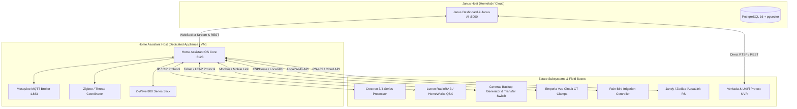

# 🛠️ Home Assistant Hardware Requirements & Estate Setup Guide

Janus uses **[Home Assistant](https://www.home-assistant.io/)** as its physical Hardware Abstraction Layer (HAL). While Janus provides the AI brain, executive dashboard, and multi-subsystem coordination, Home Assistant runs on your local network to communicate directly with physical estate protocols: Zigbee, Z-Wave, Crestron CIP, Lutron Clear Connect, Modbus, and Matter.

This guide details the recommended hardware, wireless coordinators, network topology, and estate bridging architecture.

---

## 🏗️ Hardware Architecture & Estate Topology



---

## 🖥️ 1. Recommended Home Assistant Hardware

Do not run a large estate on an unstable MicroSD card. For multi-zone residences with hundreds of entities, use one of the following proven hardware tiers:

### Tier 1: Dedicated Mini PC with Proxmox VE *(Recommended for Luxury Estates)*
* **Hardware**: Intel N100, Core i5, or AMD Ryzen Mini PC (Beelink, Minisforum, ASUS ExpertCenter).
* **RAM**: 16 GB DDR4/DDR5.
* **Storage**: 500 GB+ NVMe SSD (fast database writes for historical telemetry).
* **Networking**: Dual 2.5 GbE Ethernet NICs.
* **OS**: Proxmox VE 8.x running **Home Assistant OS (HAOS)** in a dedicated VM (4 vCPUs, 8 GB RAM, 64 GB Disk).

### Tier 2: Dedicated Turnkey Appliance
* **Home Assistant Yellow**: Official hardware featuring a Raspberry Pi Compute Module 4, onboard NVMe M.2 slot, and built-in Zigbee/Thread radio.
* **Home Assistant Green**: Entry-level appliance for smaller properties (add USB SSD for longevity).

### Tier 3: Raspberry Pi 5 (8 GB)
* **Storage**: **NVMe SSD via PCIe M.2 HAT** (never run on a MicroSD card; Home Assistant's high write frequency will corrupt SD cards within months).
* **Power**: Official Raspberry Pi 27W USB-C power supply.

---

## 📡 2. Wireless Radios & Protocol Coordinators

To communicate with local sensors, locks, shades, and climate relays without depending on the cloud:

| Protocol | Recommended USB Hardware | Use Cases |
| :--- | :--- | :--- |
| **Zigbee 3.0 / Thread** | **Home Assistant SkyConnect** or Sonoff ZBDongle-P | Door/window contact sensors, motion detectors, smart plugs, leak sensors. |
| **Z-Wave 800 Series** | **Zooz 800 Series ZST39 Long Range** | High-security deadbolts (Schlage, Yale), water main shutoff valves, exterior sirens. |
| **Lutron Clear Connect** | **Lutron Caséta Smart Bridge PRO** or **RadioRA 3 Processor** | Ultra-reliable wall keypads, dimmers, Pico remotes, and motorized Serena/Palladiom shades. |
| **Bluetooth Low Energy (BLE)** | Onboard Mini PC Bluetooth or ESP32 Bluetooth Proxies | Room-level presence tracking, Oral-B toothbrushes, Govee temperature sensors. |

> [!TIP]
> **Use USB Extension Cables**: Always connect Zigbee and Z-Wave USB sticks to your host machine using a **1-meter USB 2.0 extension cable**. Plugging them directly into USB 3.0 ports creates 2.4 GHz radio frequency interference that degrades wireless range.

---

## 🔌 3. Estate System Bridging & Protocols

### Crestron Integration (Lighting, Climate, Fireplaces)
Luxury homes frequently utilize centralized Crestron processors (CP3, CP4, AV4, DIN-AP4):
1. **Crestron-to-HA Bridge**: Communicates over local Ethernet using Crestron IP / CIP (Computer Interface Protocol) or Crestron Home API.
2. Digital joins (lights, fireplace ignition relays), analog joins (thermostat setpoints, dimmer percentages), and serial joins are mapped to native Home Assistant entities (`light.*`, `climate.*`, `switch.*`).
3. Janus automatically discovers these entities via WebSocket and exposes them on the `/home-systems` dashboard.

### Backup Power & Generator (Generac Mobile Link / Genmon)
1. **Transfer Switch & Grid Monitor**: Connected to the automatic transfer switch (ATS).
2. Monitored states: `Utility Grid Status` (Normal / Outage), `Generator Engine State` (Running / Ready / Off), `Battery Voltage`, `Engine RPM`, and `Fuel Level`.
3. If utility power drops, Janus detects `RUNNING_UTILITY_LOSS` and prompts Janus to notify the household and switch HVAC zones into power-conservation mode.

### Circuit-Level Power Monitoring (Emporia Vue 2/3)
1. 16-channel current transformer (CT) clamps installed inside the main breaker panel and sub-panels.
2. Real-time wattage draw (W) and accumulated kilowatt-hours (kWh) streamed to Home Assistant via local ESPHome firmware or the Emporia cloud API.
3. Monitored high-draw circuits: EV Wall Connectors, HVAC compressors, pool pumps, ovens, and AV server racks.

### Smart Irrigation (Rain Bird ESP-TM2 / ESP-ME3)
1. Rain Bird controllers equipped with the LNK2 Wi-Fi module connect directly to Home Assistant over the local network.
2. Zone valves, active runtimes, and rain-delay sensors are mapped into Janus for visualization on the interactive property SVG map.

---

## 🌐 4. Network Architecture & Dedicated IoT VLANs

For estate security and reliability, isolate your smart home hardware behind a commercial firewall (FortiGate, UniFi Dream Machine Pro, or pfSense):

```
┌───────────────────────────────────────────────────────────┐
│                    FortiGate / UniFi                      │
│                  Main Residential Router                  │
└─────────────────────────────┬─────────────────────────────┘
                              │
       ┌──────────────────────┼──────────────────────┐
       │ VLAN 1 (Core)        │ VLAN 20 (IoT)        │ VLAN 30 (Cameras)
       ▼                      ▼                      ▼
┌──────────────┐       ┌──────────────┐       ┌──────────────┐
│ Janus │       │Home Assistant│       │Verkada /     │
│ Server       │       │Crestron      │       │UniFi Protect │
│ (Port 5000)  │       │Lutron Bridge │       │(No WAN out)  │
│ TrueNAS /    │       │Generac       │       └──────────────┘
│ Proxmox      │       │Rain Bird     │
└──────────────┘       └──────────────┘
```

### Firewall Rules:
1. **Allow Janus (VLAN 1) → Home Assistant (VLAN 20)** on ports `8123` (HTTP/WebSocket) and `1883` (MQTT).
2. **Allow Trusted Devices (VLAN 10) → Janus (VLAN 1)** on port `5000` (Web UI).
3. **Block IoT & Cameras (VLAN 20/30) → Core VLAN (VLAN 1)** to prevent smart devices from reaching sensitive estate storage.

---

## 🚀 5. Step-by-Step Home Assistant OS Setup

### Step 1: Install Home Assistant OS (HAOS)
Download the official HAOS image for your hardware from [home-assistant.io/installation](https://www.home-assistant.io/installation/).

### Step 2: Install Critical Add-ons
From the Home Assistant sidebar, navigate to **Settings → Add-ons → Add-on Store**:
1. **Mosquitto Broker**: MQTT event message bus.
2. **File Editor / Studio Code Server**: Configuration editor.
3. **Advanced SSH & Web Terminal**: Root console access.

### Step 3: Generate Long-Lived Access Token
1. Click your user profile in the bottom-left corner of Home Assistant.
2. Scroll down to **Long-Lived Access Tokens** → **Create Token**.
3. Name it `Household-OS`.
4. Copy the token into your Janus `.env`:
   ```env
   HA_URL=http://homeassistant.local:8123
   HA_TOKEN=eyJhbGciOiJIUzI1NiIsInR5cCI6IkpXVCJ9...
   ```

### Step 4: Verify Connection
Test the bridge from your Janus terminal:
```bash
curl -H "Authorization: Bearer $HA_TOKEN" \
  -H "Content-Type: application/json" \
  http://homeassistant.local:8123/api/states
```

You will receive a JSON payload of all physical devices in your estate. Janus will immediately begin synchronizing state changes!
