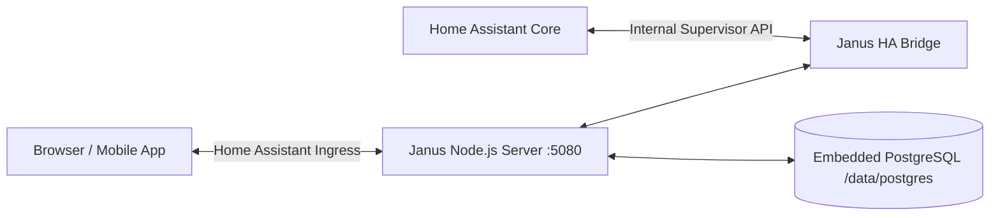

# 🏛️ Janus Home Automation — Home Assistant Add-on

[](https://my.home-assistant.io/redirect/supervisor_add_addon_repository/?repository_url=https%3A%2F%2Fgithub.com%2Ftonysafoian%2Fjanus-home-app)

Janus can be deployed directly inside **Home Assistant OS** or **Home Assistant Supervised** as an official Add-on with full **Ingress** integration.

---

## ⚡ 1-Click Installation

### Option 1: My Home Assistant (Fastest)

Click the button below to automatically add this repository and navigate to the Janus add-on in your Home Assistant instance:

[](https://my.home-assistant.io/redirect/supervisor_add_addon_repository/?repository_url=https%3A%2F%2Fgithub.com%2Ftonysafoian%2Fjanus-home-app)

### Option 2: Manual Repository Addition

1. In Home Assistant, go to **Settings ➔ Apps** (labeled **Add-ons** in older versions) **➔ App Store**.
2. Click the three dots (⋮) in the top-right corner and select **Repositories**.
3. Paste the repository URL:
   ```
   https://github.com/tonysafoian/janus-home-app
   ```
4. Click **Add**, then close the dialog.
5. Search for **Janus** in the Add-on Store list.
6. Click **Install**.
7. Enable **Show in sidebar**.
8. Click **Start**, then click **Open Web UI**.

---

## 🌟 Why Run Janus inside Home Assistant?

1. **Zero Configuration for Home Assistant Connection**:
   - The add-on automatically detects the internal Home Assistant Supervisor API and authenticates securely without requiring manual Long-Lived Access Tokens.
2. **Native Ingress Experience**:
   - Janus mounts seamlessly into your Home Assistant sidebar. You never need to remember separate ports or configure separate reverse proxies.
3. **Built-in Embedded PostgreSQL**:
   - Runs an isolated PostgreSQL 16 database stored in your Home Assistant `/data` partition, keeping all historical telemetry, scene automations, and AI memory persisted across restarts.
4. **Instant 1-Click Demo Mode**:
   - Includes a 1-click **⚡ Enter Demo / Local Test Mode** button on the login screen so you can immediately explore the estate command deck without setting up external OAuth.

---

## ⚙️ Configuration Reference

In the add-on **Configuration** tab in Home Assistant:

```yaml
enable_demo_login: true
enable_mock_mode: false
gemini_api_key: ""
database_url: ""
```

| Parameter | Type | Default | Description |
| :--- | :--- | :--- | :--- |
| `enable_demo_login` | boolean | `true` | Enables the 1-click Demo / Local Test login button on the auth screen. |
| `enable_mock_mode` | boolean | `false` | Generates simulated hardware telemetry for offline development and testing. |
| `gemini_api_key` | string | `""` | *(Optional)* Google Gemini API key to activate Janus Voice AI and autonomous reasoning. |
| `database_url` | string | `""` | *(Optional)* Custom external PostgreSQL connection string. If omitted, Janus uses its embedded PostgreSQL database. |

---

## 🏗️ Technical Architecture in Home Assistant


